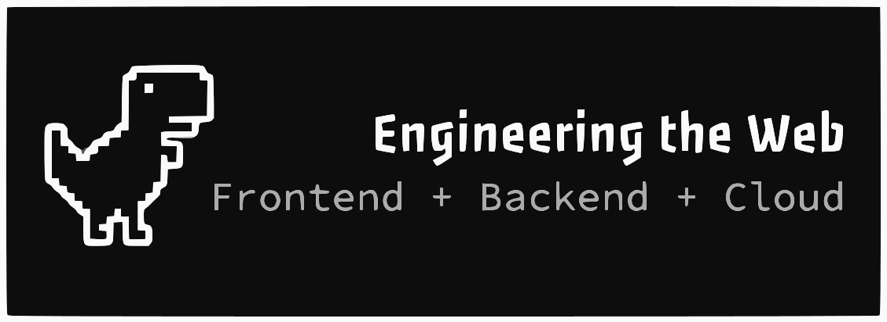

  # Hi, I'm Arjun Kumar Sharma

<h2 align="center">
  <samp>
    💻 FULL-STACK &nbsp; ☁️ DEVOPS &nbsp; 🤖 AI/ML
  </samp>
</h2>

## 📚 Core Skills & Expertise

| Area | Expertise | Key Technologies |
| :--- | :--- | :--- |
| **💻 Programming** | **Algorithmic** Problem-Solving & System Design |  |
| **⚛️ Frontend** | Expert in **Modern, Responsive UI/UX** |  |
| **⚙️ Backend & APIs** | **Robust Server** and RESTful API Development |  |
| **🗄️ Databases** | Full-Stack **Data Management** (NoSQL & Relational) |  |
| **☁️ DevOps & Infra** | **CI/CD**, Containerization, and Cloud Architecture |  |
| **🛠️ Tools & VCS** | Professional **Development Workflow** & Collaboration |  |

---

## 🔗 Let's Connect

  **I'm always open to discussing new projects, collaboration opportunities, or technical challenges. Feel free to reach out!**

  &nbsp;&nbsp;
  &nbsp;&nbsp;
  

---

## 📊 GitHub Analytics

  <!--  -->
  
  <!--  -->

---

  

